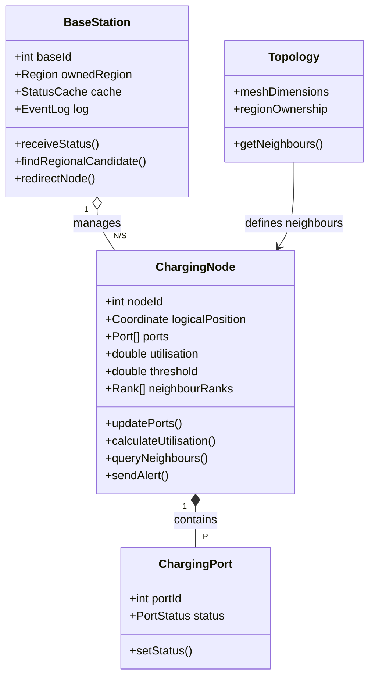
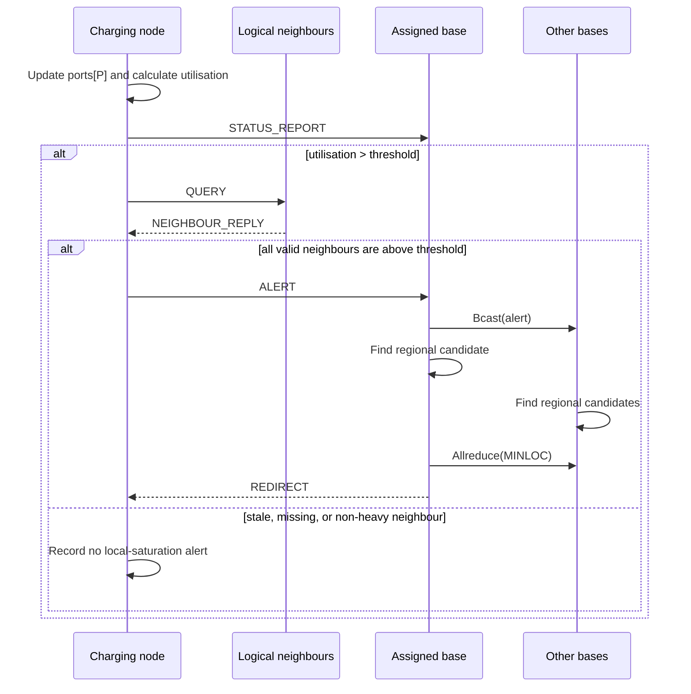

# FIT3143 Applied #1 - EVCNS Design Architecture and Communication Analysis

> **Status:** Design document for Tasks 1-3. It describes the proposed simulation architecture and analytical model; it does not claim that physical EV stations are arranged in a grid or that a source-code implementation has already been submitted.

**Team:** Group 07
**Members:** `[replace with names, IDs, and Monash emails]`

---

## Executive decision

We select a **hybrid, three-scope topology** rather than forcing one textbook topology onto every communication relationship:

| Scope | Participants | Selected logical topology | Purpose |
|---|---|---|---|
| Local sensing plane | Charging node to charging node | Non-periodic 2-D logical mesh | Confirm whether a local neighbourhood is heavily utilised. |
| Regional reporting plane | Charging node to its assigned base | Region-sharded star forest | Deliver periodic status, alerts, and redirects without global node broadcasts. |
| Inter-base control plane | Base station to base station | Small logically mutually reachable control overlay | Select the globally nearest available charging station. |

This separation is deliberate. Local sensing, regional reporting, and cross-region coordination have different scales, traffic patterns, and realism constraints, so they should not be modelled by the same topology.

---

# Task 1 - Network topology

## 1. Interpret the problem correctly

The 3 x 3 Cartesian figure in the assessment specification is illustrative. Real charging stations may be distributed irregularly across roads, car parks, or suburbs, and students are not required to construct physical station locations or physical links.

The requirement is that charging nodes communicate with their **immediate adjacent nodes** and with a base station. In this document, *adjacent* is a **logical communication relationship**, not a statement that two stations are physically connected by a cable, physically nearest, or physically placed in a perfect square lattice.

Three distinct layers must therefore be kept separate:

1. **Physical deployment:** real station locations and network infrastructure. This is an external constraint, not designed by this assessment.
2. **Logical topology:** which charging nodes may exchange local utilisation information and which base owns each node. This is the simulator design decision.
3. **Execution mapping:** how MPI processes are placed on cluster hosts and cores. This is a software-deployment decision and must not redefine logical neighbours.

## 2. Topology evaluation criteria

All Topic 5 topologies are compared using the same criteria:

- **Degree:** direct connections maintained by one node.
- **Diameter:** longest logical path between two nodes.
- **Link cost:** how communication edges grow with the number of charging nodes, `N`.
- **Locality and realism:** whether the topology can represent immediate-neighbour sensing without inventing implausible long-distance neighbours.
- **Control-plane suitability:** whether the topology supports regional coordination without requiring every charging node to see every other node.

## 3. Comparison of topology families

| Topology | Degree | Diameter | Link cost | Assessment for charging-node sensing |
|---|---:|---:|---:|---|
| Linear array | 1-2 | `N-1` | `N-1` | Simple but a local decision can traverse `O(N)` hops; poor two-dimensional locality. |
| Ring | 2 | `floor(N/2)` | `N` | Bounded degree, but only two neighbours and a wrap-around link that is often geographically artificial. |
| Star | 1 for leaves; `N-1` for hub | 2 | `N` | Good for reporting to a base, but cannot express direct local neighbour sensing and overloads one hub. |
| Binary tree | 1-3 | `O(log N)` | `N-1` | Good broadcast structure, but parent-child links do not naturally represent nearby charging stations. |
| **2-D mesh** | **2-4** | **`O(sqrt(N))`** | **`O(N)`** | **Best regular-area logical overlay for local sensing: bounded degree, locality, no central hub.** |
| 2-D torus | 4 | `O(sqrt(N))` | `O(N)` | Lower diameter, but wrap-around makes stations on opposite service-area boundaries false neighbours. |
| 3-D mesh / cube | 3-6 | `O(N^(1/3))` | `O(N)` | Adds a third locality dimension with no natural interpretation for a predominantly two-dimensional urban service area. |
| Hypercube | `log2(N)` | `log2(N)` | `N log2(N) / 2` | Strong connectivity, but growing degree and non-geographic edges do not help local station sensing. |
| Fully connected | `N-1` | 1 | `N(N-1)/2` | Minimum path length, but impractical for large `N` and unnecessary for local information exchange. |

## 4. Final topology selection

### 4.1 Local sensing plane: non-periodic 2-D logical mesh

For the simulator's regular-area baseline, charging nodes use a **non-periodic 2-D logical mesh**.

- An interior node has four logical neighbours; edge nodes have three and corner nodes have two.
- The maximum degree is therefore four.
- There are no wrap-around links. A station at one boundary is not made adjacent to a station at the opposite boundary.
- A node queries only its valid local neighbours when it is heavily utilised.

For an `R x C` logical baseline with `N = RC`, the number of undirected local edges is:

```text
E = R(C - 1) + C(R - 1) = 2N - R - C
```

Therefore the local link cost is `O(N)`, not `O(N^2)`.

This mesh is a **logical overlay and modelling baseline**, not a claim about the physical geometry of all EV stations. A strongly irregular deployment is future work: the same local-sensing principle can be represented by a configured bounded-degree adjacency graph. That extension is not the selected main model for this assessment.

### 4.2 Regional reporting plane: star forest

Each charging node is assigned to exactly one regional base station. Within a region, direct node-to-base reporting is a star; with `S` bases, the system is a **forest of regional stars**.

- Each base owns approximately `N/S` nodes.
- Nodes send status reports and alerts only to their assigned base, not to every base.
- This is where a star is appropriate: the base is intentionally an aggregation and decision hub.

### 4.3 Inter-base control plane: small control overlay

Base stations are logically mutually reachable through a shared-backbone control overlay. This does **not** assert that every pair has a dedicated physical link. It means that a small group of base processes can execute collective coordination when an alert requires a globally closest available station.

This is where high connectivity is acceptable: `S` is small compared with `N`, and inter-base coordination occurs only for alert events rather than for all periodic node traffic.

## 5. Why the hybrid design is the best fit

1. A pure star cannot satisfy local neighbour sensing.
2. A pure mesh does not naturally provide regional aggregation, logging, and global redirection.
3. A torus reduces mesh diameter but creates unrealistic wrap-around neighbours.
4. A fully connected node layer is not scalable, although high logical reachability is acceptable for the much smaller base layer.
5. The hybrid architecture applies each topology only where its strengths match the communication scope.

**Task 1 conclusion:**

> We select a non-periodic 2-D logical mesh for local charging-node sensing, a region-sharded star forest for node-to-base reporting, and a small inter-base control overlay for global coordination. This is a logical simulation topology, not a claim that physical EV stations are arranged in a Cartesian grid.

---

# Task 2 - Simulation architecture

## 1. Main model components

| Component | Main state | Main responsibility |
|---|---|---|
| `ChargingPort` | `portId`, `status` | Represents one busy or free charging port. |
| `ChargingNode` | `nodeId`, logical coordinates, `ports[P]`, utilisation, threshold, neighbour ranks | Counts local port use, queries neighbours, and reports to its base. |
| `BaseStation` | `baseId`, owned region, status cache, event log | Receives reports, records state, finds candidate stations, and coordinates redirects. |
| `Topology` | mesh dimensions, neighbour relation, region ownership | Defines local neighbour scope and base assignment. |

## 2. Static structure diagram



## 3. MPI process and communicator design

This is a design-level MPI mapping:

- World ranks `0 ... S-1` represent base stations.
- World ranks `S ... S+N-1` represent charging nodes.
- Total ranks: `N + S`.
- `MPI_COMM_WORLD` is used for direct node-to-base control messages and global lifecycle synchronisation.
- `node_comm` contains only charging-node ranks.
- `cart_comm` is created from `node_comm` using a non-periodic Cartesian topology. It carries the logical local mesh; it is not unrelated to `node_comm`.
- `base_comm` contains only base-station ranks and is used for alert coordination.

For `M` cluster machines with `C` usable cores each, a simple one-rank-per-core deployment requires:

```text
machines = ceil((N + S) / C)
```

Adjacent logical mesh tiles should be placed on the same or nearby hosts where possible, reducing cross-host local traffic without changing the logical topology.

## 4. Message protocol

| Message / operation | Direction | Trigger | Purpose |
|---|---|---|---|
| `STATUS_REPORT` | node -> assigned base | Every simulation round | Refresh the base cache and log all node data. |
| `QUERY` | heavily utilised node -> valid local neighbours | `utilisation > threshold` | Request neighbour utilisation. |
| `NEIGHBOUR_REPLY` | neighbour -> querying node | On `QUERY` | Return free ports and utilisation. |
| `ALERT` | node -> assigned base | Node and every valid replying neighbour are above threshold | Report a locally saturated neighbourhood. |
| `Bcast(alert)` | alert owner base -> all bases | Every alert | Share source id and source location. |
| `Allreduce(MINLOC)` | all bases | Every alert | Choose the globally nearest available regional candidate. |
| `REDIRECT` | alert owner base -> alerting node | Candidate selected | Return the target station or no-availability result. |

`threshold`, number of rounds, and other static parameters are provided at simulator initialisation. They do not require a separate periodic `CONFIG` message.

### Missing or stale neighbour data

A node must not treat an absent, stale, or failed neighbour response as proof that all neighbours are heavily utilised. The safe outcome is an `incomplete/stale` local assessment: log the condition and withhold the all-neighbours alert until valid data is available. This avoids a false positive saturated-quadrant alert.

## 5. Communication sequence diagram



## 6. Hybrid parallelism

MPI provides distributed-memory parallelism between nodes and bases. Shared-memory parallelism is used only where it provides a real benefit:

- For sufficiently large `P`, a charging-node process can use OpenMP to update and reduce its local `ports[P]` array.
- For typical small port counts, serial scanning is preferred because thread creation and synchronisation overhead may exceed the benefit.
- MPI communication is initiated by the master thread under an `MPI_THREAD_FUNNELED` design, avoiding concurrent MPI calls from multiple OpenMP threads.
- The deployment must satisfy:

```text
MPI ranks per host x OpenMP threads per rank <= physical cores per host
```

---

# Task 3 - Communication analysis

## 1. Definitions and delay model

| Symbol | Meaning |
|---|---|
| `N` | Number of charging nodes. |
| `S` | Number of base stations. |
| `P` | Ports per charging node. |
| `A` | Number of alerts in one simulation round. |
| `f` | Simulation update frequency in rounds per second. |
| `L` | Payload length in bytes. |
| `H_fabric` | Cluster-fabric hop count assumed constant with respect to `N`. |
| `B` | Link bandwidth: 1 Gbps. |

The transmission serialisation component is:

```text
T_tx = 8 L H_fabric / B
```

For direct node-to-base control messages, `H_fabric` is a constant modelling assumption. It must not be confused with the diameter of the logical node mesh. In a simplified equivalent-link model, `H_fabric = 1`; real measured latency would additionally contain MPI startup, switch delay, contention, and queueing.

## 2. Scaling when charging nodes increase

### Local mesh messages

For the `R x C` logical mesh:

```text
E = R(C - 1) + C(R - 1) = 2N - R - C
```

If all nodes are above threshold, the maximum per-round local-message count is:

```text
QUERY messages            = 2E
NEIGHBOUR_REPLY messages  = 2E
Total local messages      = 4E = O(N)
```

Each individual local transfer crosses one logical neighbour edge, so its serialisation term is `O(1)` for bounded payload. Whole-network local traffic is nevertheless `O(N)`.

### Node-to-base messages

Every node sends one `STATUS_REPORT` per round, hence `N` reports per round. If the load is evenly partitioned, each base receives approximately:

```text
N / S STATUS_REPORT messages per round
```

`ALERT` and `REDIRECT` messages are event-driven. Their count is `A`, where `0 <= A <= N`. A single direct control message has an `O(1)` serialisation term with respect to `N`, but the base ingress load and potential queueing grow approximately as `O(N/S)`.

### Inter-base coordination

For each alert, bases broadcast the alert and reduce regional candidates. Under a tree-based collective model, coordination has an `O(log S)` critical path per alert.

```text
T_coordination_per_round = O(A log S)
```

In the worst case, all charging nodes alert in the same round (`A = N`):

```text
T_coordination_per_round = O(N log S)
```

This is a **critical-path/round-completion** bound, not a claim that total network work of every collective is necessarily `O(A log S)`; total network work depends on the collective implementation.

## 3. Effect of increasing base stations

| Message class | Effect of increasing `S` |
|---|---|
| `QUERY` / `NEIGHBOUR_REPLY` | No direct effect; the node mesh is unchanged. |
| `STATUS_REPORT`, `ALERT`, `REDIRECT` | Reduces average per-base ingress from `O(N)` toward `O(N/S)`, reducing expected queueing and round-completion delay. |
| `Bcast(alert)` / `Allreduce(MINLOC)` | Coordination path grows approximately as `O(log S)` per alert. |

Therefore, more bases do not shorten an already direct node-to-base transmission term. They reduce regional aggregation pressure. The benefit eventually shows diminishing returns because collective coordination and fixed communication overhead remain.

### Single-base boundary case

When `S = 1`, inter-base coordination degenerates to a singleton operation. The only base searches its local cache, which is also the global cache, and no cross-base communication is required.

## 4. Required graphs

The presentation should contain at least:

1. Per-message transmission serialisation and/or end-to-end response proxy versus increasing `N` at fixed `S`.
2. Per-message transmission serialisation and/or queueing proxy versus increasing `S` at fixed `N`.
3. A third graph for another growth factor, preferably update frequency `f`. Increasing `f` raises offered load linearly and increases queueing once base ingress approaches link/service capacity.

Graphs must label whether they display raw `T_tx` or an end-to-end/queueing estimate. Raw serialisation delay may remain constant while aggregate traffic and queueing grow; these must not be presented as the same quantity.

---

# Presentation and Q&A anchors

## Short conclusion

> We do not apply one topology to every communication relationship. The local node layer uses a non-periodic 2-D logical mesh to preserve immediate-neighbour sensing with bounded degree. Regional stars support node reporting and redirection, while a small inter-base control overlay selects globally closest available stations. The mesh is a logical baseline, not a claim that physical EV stations form a grid.

## Likely questions

| Question | Concise answer |
|---|---|
| Are real charging stations physically arranged in a grid? | No. The grid is the simulator's logical local-sensing baseline; physical placement is outside the task scope. |
| Why not use a star for all messages? | A star works for reporting to a base but removes the direct neighbour relationship required to confirm local saturation. |
| Why not use a torus? | Its wrap-around links create false neighbours across real service-area boundaries. |
| How many local neighbours does a node have? | In the mesh baseline: four for interior nodes, three on an edge, and two at a corner. Maximum degree is four. |
| Why do more bases help? | They reduce the average regional ingress load from about `N` to `N/S`; they do not shorten a direct control message's serialisation term. |
| Why is global coordination needed after an alert? | A free local candidate is not necessarily the globally nearest available station; all bases contribute regional candidates to `MINLOC`. |
| What happens if a neighbour does not reply? | The node records incomplete/stale data and withholds the all-neighbours saturation alert rather than generating a false positive. |

---

# References

1. FIT3143 Applied #1 - Distributed Wireless Sensor Network assessment specification.
2. FIT3143 Applied #1 marking rubric.
3. FIT3143 Topic 5 - network topology and MPI material.
4. Teaching-team Ed clarification: the 3 x 3 grid is illustrative; immediate adjacent-node communication is a requirement; physical EV nodes are not being built by students; topology or hybrid topology should be selected for a real-life situation.
