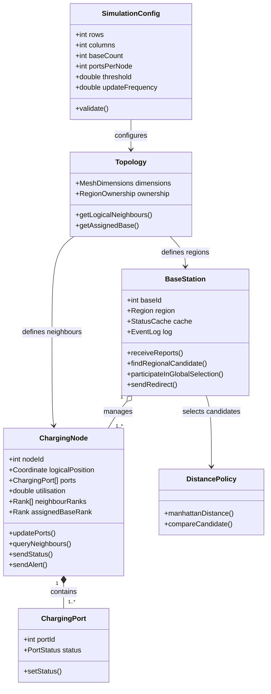
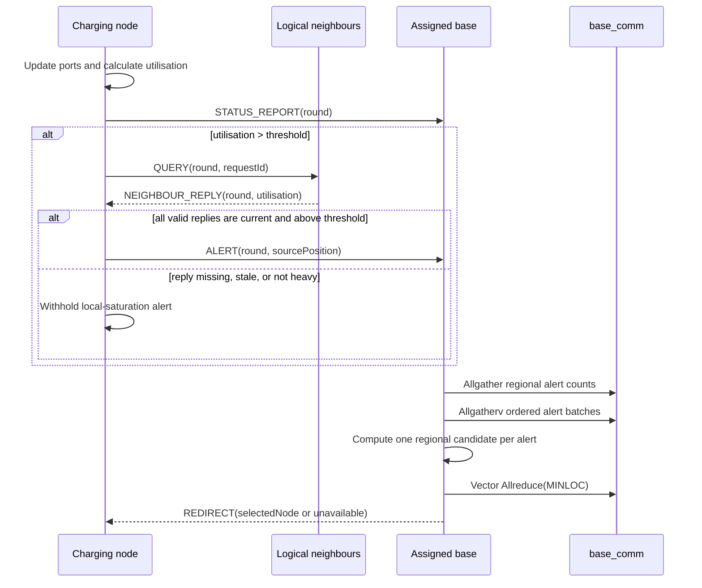

# FIT3143 Applied #1 - EVCNS Design Architecture and Communication Analysis

> **Status:** Revised design document for Tasks 1-3. It specifies a proposed simulator and analytical model; it does not claim that the simulator has already been implemented or that physical EV stations form a grid.

**Team:** Group 07  
**Members:** `[replace with names, student IDs, and Monash email addresses]`

---

## Executive decision

The proposed simulator uses a **hybrid, three-plane logical topology**:

| Plane | Participants | Selected logical topology | Purpose |
|---|---|---|---|
| Local sensing | Charging node to charging node | Non-periodic 2-D mesh | Exchange utilisation data with one-hop logical neighbours. |
| Regional reporting | Charging node to assigned base station | Forest of regional stars | Aggregate status, alerts, and redirection results without sending every report to every base. |
| Inter-base control | Base station to base station | Logically complete control communicator | Coordinate a global nearest-available-node decision among a small number of bases. |

These are application-level communication relationships. They do not prescribe the physical placement of charging stations or the physical wiring of the cluster.

### Baseline parameters used for concrete sizing

The design remains parameterised, but the following baseline makes the machine, core, delay, and bandwidth calculations reproducible:

| Parameter | Baseline value | Meaning |
|---|---:|---|
| `R x C` | `8 x 8` | Non-periodic logical charging-node mesh. |
| `N` | 64 | Charging nodes, where `N = RC`. |
| `S` | 4 | Regional base stations. |
| `P` | 16 | Charging ports per node. |
| `f` | 1 round/s | Simulation update frequency. |
| `C_host` | 32 cores | Usable physical cores per cluster machine. |
| `B` | 1 Gbps | Cluster-link bandwidth required by the specification. |
| `A` | `0 <= A <= N` | Alerts generated in one round. |

`N`, `S`, `P`, and `f` are user-configurable. The baseline is an evaluation scenario, not a restriction of the architecture.

---

# Task 1 - Network topology

## 1. Problem interpretation

The 3 x 3 Cartesian layout in the assessment specification is illustrative. The assessment does not require students to decide where physical charging stations are installed. However, each simulated charging node must communicate with its **immediate adjacent nodes** and with a base station.

In this design, an adjacent charging node means a **one-hop neighbour in the selected logical topology**. It does not necessarily mean the physically nearest station. Physical station information may guide the mapping of stations to logical coordinates, but the logical mesh edges define which nodes participate in the local-neighbour protocol.

Three concepts must remain separate:

1. **Physical EV deployment:** real station locations and communication infrastructure, which are external inputs and outside the construction scope of this assessment.
2. **Logical simulation topology:** the application-level neighbour, ownership, and control relationships represented by MPI ranks and communicators.
3. **Cluster execution mapping:** placement of MPI ranks and OpenMP threads on machines and cores. This affects physical network traffic but does not redefine logical neighbours.

## 2. Evaluation criteria

The Week 5 topology families are compared using:

- node degree and per-node communication responsibility;
- diameter and worst-case logical path length;
- bisection width and ability to sustain concurrent cross-network traffic;
- arc connectivity and link-failure tolerance;
- link cost and asymptotic scalability; and
- suitability for local sensing, regional aggregation, and realistic simulation.

Let `N` denote the number of charging nodes. Square and cubic formulas assume ideal regular dimensions. Logarithms are base 2.

## 3. Comparison of Week 5 topologies

| Topology | Degree | Diameter | Bisection width | Arc connectivity | Link cost | Assessment for this WSN |
|---|---:|---:|---:|---:|---:|---|
| Linear array | 1 or 2 | `N-1` | 1 | 1 | `N-1` | Low cost, but only one-dimensional locality, long paths, and a single internal-link failure can partition the network. |
| Ring | 2 | `floor(N/2)` | 2 | 2 | `N` | Uniform degree and two directions, but only two neighbours and the closing edge may create an artificial boundary relationship. |
| Star | 1 at leaves; `N-1` at hub | 2 | 1 under the Week 5 convention | 1 | `N-1` | Appropriate for regional reporting, but unsuitable as the only topology because local node-to-node sensing would depend on a central hub. |
| Perfect binary tree | 1, 2, or 3 | `2 log2((N+1)/2)` | 1 | 1 | `N-1` | Bounded degree and logarithmic diameter, but parent-child relations do not naturally represent a two-dimensional local-neighbour protocol. |
| **2-D mesh** | **2, 3, or 4** | **`2(sqrt(N)-1)` for a square mesh** | **`sqrt(N)`** | **2** | **`2(N-sqrt(N))`** | **Best regular logical baseline for local sensing: bounded degree, linear cost, no hub, and no artificial wrap-around.** |
| 2-D torus | 4 | approximately `sqrt(N)` | `2sqrt(N)` | 4 | `2N` | Improves diameter and resilience, but wrap-around makes opposite logical boundaries immediate neighbours. |
| 3-D cube/mesh | 3 to 6 | `3(N^(1/3)-1)` | `N^(2/3)` | 3 | `3(N-N^(2/3))` | Better diameter than a 2-D mesh, but introduces a third locality dimension with no necessary role in this service-area model. |
| Hypercube | `log2(N)` | `log2(N)` | `N/2` | `log2(N)` | `N log2(N)/2` | Strong path diversity, but growing node degree and binary-address neighbours are unnecessary for local sensing. |
| Completely connected | `N-1` | 1 | `floor(N^2/4)` | `N-1` | `N(N-1)/2` | Minimum diameter, but quadratic cost and all-to-all node communication are unnecessary and unscalable. |

Dense topologies reduce logical diameter at the cost of additional non-local relationships and communication responsibility. Sparse array, tree, and star structures reduce link cost but create bottlenecks or remove required local relationships. No single textbook topology is optimal for all three communication scopes.

## 4. Selected hybrid topology

### 4.1 Local sensing plane: non-periodic 2-D logical mesh

The main assessment model uses an `R x C` non-periodic logical mesh with `N = RC` charging nodes.

- Interior nodes have four logical neighbours, edge nodes have three, and corner nodes have two.
- `periods = {false, false}` prevents wrap-around.
- A heavily utilised node sends `QUERY` only to valid one-hop logical neighbours.
- The mesh is a logical overlay, not a claim that physical EV stations occupy regular Cartesian positions.

The exact diameter and undirected local-edge count are:

```text
D_mesh = R + C - 2
E_mesh = R(C - 1) + C(R - 1) = 2N - R - C
```

For a square mesh, `D_mesh = 2(sqrt(N)-1)` and `E_mesh = 2(N-sqrt(N))`. Therefore, local logical link cost is `Theta(N)`, not `Theta(N^2)`.

A future extension may load an irregular bounded-degree adjacency graph. That extension is not required for the selected regular logical baseline.

### 4.2 Regional reporting plane: forest of stars

Each charging node is assigned to exactly one regional base station. The assignment is configured at initialisation; for the baseline, the `8 x 8` mesh is divided into four `4 x 4` logical tiles.

- Each base owns 16 charging nodes in the baseline and approximately `N/S` nodes under balanced partitioning.
- Nodes send `STATUS_REPORT`, `ALERT`, and receive `REDIRECT` only through their assigned base.
- Local neighbour exchanges remain direct and are not routed through a base.

The regional stars deliberately use the base as an aggregation and decision hub while avoiding one global base with `O(N)` responsibility.

### 4.3 Inter-base control plane: logically complete communicator

All `S` base-station ranks belong to `base_comm`. At the application level, every base is mutually reachable through this communicator, so the base layer is logically complete.

This does not imply `S(S-1)/2` dedicated physical links. MPI collectives are transported over the cluster's existing network and may internally use tree, ring, or hardware-aware algorithms. A highly connected logical control layer is acceptable because `S << N` and coordination is event-driven rather than part of every local neighbour exchange.

## 5. Why the hybrid topology is the best fit

1. A pure star cannot represent direct logical-neighbour sensing.
2. A pure mesh provides local sensing but does not by itself express regional ownership, logging, or global redirection responsibility.
3. A torus improves graph metrics by creating wrap-around neighbours that are not required by the service-area model.
4. A completely connected charging-node layer has quadratic cost, whereas high logical reachability is affordable for the much smaller base layer.
5. Regional partitioning reduces average base responsibility from `N` to approximately `N/S` nodes.
6. The logical mesh maps directly to an MPI Cartesian communicator, while the base communicator supports safe collective coordination.
7. The separation of logical topology and execution mapping permits locality-aware deployment without claiming that the physical cluster or EV stations use the same topology.

## 6. Task 1 conclusion

The selected design combines a **non-periodic 2-D logical mesh** for local charging-node sensing, a **forest of regional stars** for node-to-base reporting, and a **logically complete base-station communicator** for global coordination. Each topology is used only where its strengths match the communication scope. The design preserves one-hop logical adjacency with bounded node degree, distributes reporting load across multiple bases, and supports global redirection without an all-to-all charging-node network. It is a logical simulation model rather than a claim about the physical geometry of EV stations.

---

# Task 2 - Simulation architecture

## 1. Model components

| Component | Important state | Responsibility |
|---|---|---|
| `SimulationConfig` | `R`, `C`, `S`, `P`, `threshold`, `rounds`, `f` | Validates user-configurable parameters and broadcasts immutable configuration. |
| `ChargingPort` | `portId`, `status` | Represents one free or occupied charging port. |
| `ChargingNode` | `nodeId`, logical coordinate, `ports[P]`, utilisation, neighbour ranks, assigned base rank | Updates port state, evaluates utilisation, queries neighbours, and reports status or alerts. |
| `BaseStation` | `baseId`, region, regional status cache, event log | Receives regional reports, computes regional candidates, participates in global selection, and returns redirects. |
| `Topology` | mesh dimensions, Cartesian neighbours, regional ownership | Creates the non-periodic mesh and assigns each charging node to one base. |
| `DistancePolicy` | distance function and tie-break rule | Calculates logical distance and makes nearest-candidate selection deterministic. |

For the baseline, the distance from source node `(r_s,c_s)` to candidate `(r_t,c_t)` is the Manhattan distance:

```text
d = abs(r_s - r_t) + abs(c_s - c_t)
```

If two available candidates have the same distance, the smaller `nodeId` wins. Thus every base produces consistent `(distance, nodeId)` values for `MPI_MINLOC`.

## 2. Static structure diagram source



The multiplicity means that every charging node contains one or more ports and is owned by exactly one base station; a base manages one or more nodes in the selected baseline.

## 3. MPI ranks and communicators

- World ranks `0 ... S-1` represent base stations.
- World ranks `S ... S+N-1` represent charging nodes.
- Total MPI ranks: `N + S`.
- `node_comm` contains only charging-node ranks.
- `cart_comm` is a non-periodic Cartesian communicator derived from `node_comm` using `MPI_Dims_create` and `MPI_Cart_create`.
- `MPI_Cart_shift` supplies valid north, south, east, and west logical neighbours; missing boundary neighbours are `MPI_PROC_NULL`.
- `base_comm` contains all base-station ranks and executes one scheduled coordination phase per simulation round.
- `MPI_COMM_WORLD` carries direct node-to-assigned-base messages and lifecycle synchronisation.

The program requests `MPI_THREAD_FUNNELED`: only the master thread makes MPI calls, while OpenMP workers operate on process-local shared state.

## 4. Message protocol and payload model

The baseline payload sizes exclude MPI and lower-level protocol headers. A 25% bandwidth margin is added later for these overheads.

| Message / collective data | Direction | Trigger | Payload | Purpose |
|---|---|---|---:|---|
| `CONFIG_BCAST` | coordinator -> all ranks | Once at initialisation | 64 B | Distribute validated immutable configuration. |
| `STATUS_REPORT` | node -> assigned base | Once per round | 32 B | Node id, round, free/busy counts, utilisation, and logical position. |
| `QUERY` | heavy node -> each valid logical neighbour | `utilisation > threshold` | 16 B | Source id, round, and request id. |
| `NEIGHBOUR_REPLY` | neighbour -> querying node | Valid `QUERY` | 24 B | Node id, round, free ports, and utilisation. |
| `ALERT` | node -> assigned base | Source and all valid replies exceed threshold | 32 B | Source id, round, utilisation, position, and region. |
| Alert count | all bases via `MPI_Allgather` | Once per round | 4 B per base | Determine alert-batch offsets and whether global selection is required. |
| Alert batch | all bases via `MPI_Allgatherv` | Once per round | 32 B per alert | Give every base the same ordered alert list. |
| Candidate pair | all bases via vector `MPI_Allreduce(MINLOC)` | Once per non-empty alert batch | 16 B per alert | Select global `(distance,nodeId)` winner for every alert. |
| `REDIRECT` | alert-owning base -> source node | Global candidate selected | 24 B | Source id, selected node id, distance, and result status. |

`CONFIG_BCAST` and the final zero-payload lifecycle barrier are one-time operations. They affect startup/completion latency but not steady-state bandwidth per simulation round.

### 4.1 Safe collective schedule

Using one independently rooted `MPI_Bcast` per alert is unsafe when several bases receive alerts concurrently because all ranks must call collectives in the same order. The revised protocol batches work by round:

1. Every base receives all regional `STATUS_REPORT` and `ALERT` messages for the current round.
2. Every base calls the same `MPI_Allgather` to exchange local alert counts.
3. Every base calls `MPI_Allgatherv` once, including bases with zero local alerts, producing an identical alert list ordered by `(round, sourceNodeId)`.
4. Each base computes its closest available regional candidate for every alert.
5. Every base calls one vector `MPI_Allreduce` with `MPI_MINLOC` over the ordered candidate array.
6. The base that owns each source node sends the resulting `REDIRECT`.

This fixed collective schedule prevents mismatched roots and inconsistent collective ordering.

### 4.2 Missing or stale data

Reports include the simulation round. A node does not interpret a missing, failed, or stale `NEIGHBOUR_REPLY` as evidence of high utilisation. It records an incomplete local assessment and withholds the all-neighbours alert. A regional candidate is eligible only when it has at least one free port and its utilisation does not exceed the threshold. A base excludes ineligible or stale candidate data from `MINLOC` by contributing `(infinity, invalidNodeId)` when it has no valid regional candidate.

## 5. Communication sequence diagram source



## 6. Hybrid parallelism

MPI supplies distributed-memory parallelism across charging nodes and base stations. OpenMP supplies shared-memory parallelism inside computationally heavier base-station work:

- Each charging node uses one MPI rank and one core in the baseline. Scanning `P = 16` ports is serial because parallel overhead is likely to exceed the work.
- Each base-station rank uses four OpenMP threads to search disjoint sections of its regional cache and construct its candidate vector.
- Each OpenMP team performs a deterministic local reduction before the master thread calls MPI.
- `MPI_THREAD_FUNNELED` prevents worker threads from making MPI calls.
- If a future configuration has a sufficiently large `P`, a node may use `t_node > 1` OpenMP threads, but the machine formula must then include those cores.

For region `s`, with `n_s` charging nodes, `t_node` cores per node rank, and `t_base` cores per base rank:

```text
cores_s = n_s t_node + t_base
machines_s = ceil(cores_s / C_host)
```

A packed lower bound for the complete cluster is:

```text
machines_min = ceil((N t_node + S t_base) / C_host)
```

The selected mapping may use more than this lower bound to improve locality.

## 7. Concrete machine and core allocation

For the baseline `N = 64`, `S = 4`, and `C_host = 32`:

- each region owns one `4 x 4` logical tile containing 16 node ranks;
- each node rank uses `t_node = 1` core;
- each base rank uses `t_base = 4` OpenMP threads/cores;
- each region therefore uses `16(1) + 4 = 20` cores.

The packed mathematical lower bound is:

```text
machines_min = ceil((64 x 1 + 4 x 4) / 32) = ceil(80/32) = 3
```

The design deliberately selects **four 32-core machines**, one per region:

| Machine | MPI ranks | Active physical cores | Logical responsibility |
|---|---|---:|---|
| Host 0 | Base 0 + 16 node ranks | 20 | Top-left `4 x 4` tile. |
| Host 1 | Base 1 + 16 node ranks | 20 | Top-right `4 x 4` tile. |
| Host 2 | Base 2 + 16 node ranks | 20 | Bottom-left `4 x 4` tile. |
| Host 3 | Base 3 + 16 node ranks | 20 | Bottom-right `4 x 4` tile. |

The remaining 12 cores per host provide capacity for MPI progress, operating-system work, larger future regions, or additional OpenMP threads without oversubscription. Node-to-assigned-base messages and most logical-neighbour messages remain on one host. Only logical mesh edges crossing tile boundaries and inter-base collectives require the external 1 Gbps network.

## 8. Required network bandwidth

For the `8 x 8` mesh:

```text
E_mesh = 8(7) + 8(7) = 112 undirected logical edges
```

The four `4 x 4` tile mapping creates eight cross-host edges across the vertical split and eight across the horizontal split:

```text
E_cross = 16 undirected cross-host neighbour edges
```

Let the worst-case baseline have all nodes above threshold and `A = N = 64` alerts in one round. Because each undirected edge is queried in both directions, cross-host local traffic is:

```text
QUERY + REPLY bytes
= 2 E_cross (L_query + L_reply)
= 2(16)(16 + 24)
= 1,280 B/round
```

Node-to-assigned-base `STATUS_REPORT`, `ALERT`, and `REDIRECT` messages are intra-host under the selected mapping and do not consume the external links. For conservative inter-base aggregate network work:

```text
Allgatherv alert delivery
= A(S - 1)L_alert
= 64(4 - 1)(32)
= 6,144 B/round

Allgather alert-count delivery
= S(S - 1)L_count
= 4(4 - 1)(4)
= 48 B/round

Recursive-doubling Allreduce estimate
= S log2(S) A L_candidate
= 4(2)(64)(16)
= 8,192 B/round
```

The resulting conservative aggregate external-network volume is:

```text
D_external = 1,280 + 48 + 6,144 + 8,192
           = 15,664 B/round
```

At `f = 1 round/s`, including a 25% protocol and safety margin:

```text
BW_required = 1.25 x 8 x f x D_external
            = 1.25 x 8 x 1 x 15,664
            = 156,640 bit/s
            = 0.15664 Mbps
```

Even this worst-alert baseline is far below 1 Gbps. At `f = 10 rounds/s`, the estimate increases linearly to approximately `1.5664 Mbps`. This is an aggregate conservative estimate; a final implementation should measure per-link traffic, MPI startup latency, contention, and collective implementation effects.

---

# Task 3 - Communication analysis

## 1. Delay model

Let:

- `L_m` be the payload size in bytes for message type `m`;
- `B = 10^9 bit/s` be the link bandwidth;
- `alpha` be MPI startup plus propagation/switch latency per physical communication step;
- `h_m` be the number of physical communication steps on the critical path.

The payload serialisation time on one 1 Gbps link is:

```text
T_ser(m) = 8 L_m / B
```

A simplified end-to-end model is:

```text
T_message(m) = h_m alpha + h_m (8 L_m / B)
```

The assignment supplies bandwidth but not `alpha`, so numerical results below report exact serialisation time. Graphs that include end-to-end latency must state an explicit measured or assumed `alpha` rather than presenting it as a supplied value.

## 2. Per-message serialisation delay

| Message data | Payload | Serialisation at 1 Gbps |
|---|---:|---:|
| Alert count | 4 B | 0.032 microseconds |
| `QUERY` | 16 B | 0.128 microseconds |
| Candidate pair | 16 B | 0.128 microseconds |
| `NEIGHBOUR_REPLY` | 24 B | 0.192 microseconds |
| `REDIRECT` | 24 B | 0.192 microseconds |
| `STATUS_REPORT` | 32 B | 0.256 microseconds |
| `ALERT` | 32 B | 0.256 microseconds |
| `CONFIG_BCAST` | 64 B | 0.512 microseconds per link step; one-time only |
| Alert batch | `32A` B | `0.256A` microseconds per link step |
| Candidate vector | `16A` B | `0.128A` microseconds per link step |

For fixed-size point-to-point messages, raw serialisation time is `Theta(1)` with respect to both `N` and `S`. Increasing system size changes message counts, aggregate offered load, queueing, processing load, and collective critical paths; it does not change the serialisation time of one fixed-size message.

## 3. Scaling with the number of charging nodes

For the `R x C` non-periodic logical mesh:

```text
E_mesh = R(C - 1) + C(R - 1) = 2N - R - C
```

If every node is above threshold, each undirected edge carries a query in both directions and one reply per query:

```text
QUERY count per round           = 2E_mesh
NEIGHBOUR_REPLY count per round = 2E_mesh
Total local-message count       = 4E_mesh = Theta(N)
```

The message classes scale as follows for bounded payloads:

| Message class | Count/load as `N` increases at fixed `S` | Individual serialisation |
|---|---|---|
| `STATUS_REPORT` | `N` per round globally; approximately `N/S` per base | `Theta(1)` |
| `QUERY` | At most `2E_mesh = Theta(N)` per round | `Theta(1)` |
| `NEIGHBOUR_REPLY` | At most `2E_mesh = Theta(N)` per round | `Theta(1)` |
| `ALERT` | `A`, where `0 <= A <= N` | `Theta(1)` |
| `REDIRECT` | At most `A` | `Theta(1)` |
| Alert batch | `32A` bytes of payload represented per round | `Theta(A)` per collective buffer |
| Candidate vector | `16A` bytes per base contribution | `Theta(A)` per collective buffer |

If the alert fraction is `rho`, then `A = rho N`. Inter-base collective payloads grow as `Theta(N)` at fixed `rho`, while regional base search and ingress pressure grow approximately as `Theta(N/S)`. Therefore, increasing `N` raises aggregate traffic and may increase queueing and round-completion time even though the raw delay of one fixed-size message remains constant.

## 4. Scaling with the number of base stations

At fixed `N`, balanced partitioning assigns approximately `N/S` nodes to each base.

| Communication or work | Effect of increasing `S` |
|---|---|
| Local `QUERY` and `NEIGHBOUR_REPLY` | Logical mesh is unchanged; no direct count reduction. Physical cross-host count may change with rank placement. |
| `STATUS_REPORT` ingress | Falls from `Theta(N)` at one base toward `Theta(N/S)` per base. |
| Regional candidate search | Falls toward `Theta(N/S)` work per alert per base. |
| Direct `ALERT` and `REDIRECT` serialisation | Remains `Theta(1)` for fixed payload. |
| Inter-base `Allgatherv` | More bases participate; communication cost depends on the collective algorithm and payload distribution. |
| Vector `Allreduce(MINLOC)` | Recursive-doubling critical path is approximately `Theta(log S)` steps for power-of-two `S`. |

For a candidate vector of `A` pairs, a simplified recursive-doubling critical-path model is:

```text
T_allreduce(A,S)
approximately ceil(log2(S)) [alpha + 8(16A)/B]
```

Increasing `S` therefore does not shorten the transmission of one direct node-to-base message. Its main benefit is lower per-base ingress, cache size, queueing, and search work. This benefit has diminishing returns because inter-base collective participation and fixed overhead increase.

When `S = 1`, `base_comm` is a singleton. Alert exchange and global reduction become local operations, and the only base's regional candidate is also the global candidate.

## 5. Other growing factors

- **Ports per node `P`:** increases local port-update work as `Theta(P)`. It does not change fixed report payload if reports contain only counts, but it may justify OpenMP at large `P`.
- **Update frequency `f`:** multiplies offered bandwidth approximately linearly: `BW(f) = f BW(1)` until congestion and queueing cause nonlinear delay growth.
- **Alert fraction `rho`:** with `A = rho N`, both alert-batch and candidate-vector payloads grow linearly in `rho`.
- **Physical cross-host edge count `E_cross`:** increases network traffic without changing the logical mesh. Locality-aware rank placement attempts to minimise it.

## 6. Data models reserved for later graphs

No graphs are generated in this revision. The later presentation should produce, at minimum:

1. increasing `N` at fixed `S`, plotting raw serialisation separately from aggregate/round-completion delay;
2. increasing `S` at fixed `N`, showing reduced per-base load against increasing collective cost; and
3. increasing `f`, `P`, or `rho` as the additional HD-level growth factor.

Suggested data points are:

```text
N: 64, 144, 256, 400, 576, 784, 1024
S: 1, 2, 4, 8, 16, 32
f: 1, 2, 5, 10, 20, 50, 100 rounds/s
```

Every graph must identify its message class, assumptions, units, fixed parameters, and whether the y-axis is raw serialisation, aggregate network time, estimated queueing, or complete round latency.

## 7. Task 3 conclusion

The delay of one bounded point-to-point payload over a 1 Gbps link is constant with respect to `N` and `S`, but system-level communication is not constant. Local query/reply traffic and periodic reporting grow as `Theta(N)`, per-base reporting and search load decrease toward `Theta(N/S)`, and inter-base reduction adds an approximately `Theta(log S)` critical path. Multiple bases improve scalability by distributing ingress and computation, but cannot indefinitely reduce delay because coordination and fixed MPI overhead remain.

---

# Limitations and future work

- The main local topology is a regular logical mesh. A future version may load an irregular bounded-degree graph without changing the local-neighbour protocol.
- The baseline uses logical Manhattan distance, not road-network travel time. A production system should use geographic coordinates and a weighted road graph.
- A charging node has one assigned base and bases are not replicated. Future work should add a secondary base, heartbeat detection, and state replication for failover.
- Payload sizes and the 25% protocol margin are explicit modelling assumptions. An implementation should measure MPI latency, actual serialised sizes, contention, and per-link throughput.
- The complete logical base communicator is practical only while `S` remains small. Hierarchical base groups may be required at much larger scale.
- Graphs and experimental validation remain to be generated before final submission.

# Overall conclusion

The design uses topology according to communication scope: a non-periodic logical mesh for bounded local sensing, regional stars for scalable aggregation, and a small complete logical base communicator for global selection. One MPI rank represents each charging node and base station, while OpenMP accelerates base-side candidate search under `MPI_THREAD_FUNNELED`. The concrete 64-node baseline uses four 32-core machines, keeps most node and base traffic within regional hosts, and requires an estimated 0.15664 Mbps of external aggregate bandwidth at one round per second under the stated worst-alert assumptions. The communication analysis distinguishes constant per-message serialisation from increasing aggregate load and explains both the benefit and diminishing returns of additional base stations.

---

# AI-use declaration template

> Generative AI was used during assessment preparation to help review the specification and rubric, discuss topology and MPI design alternatives, and improve the clarity of the written analysis. All proposed claims, formulas, assumptions, and final wording were reviewed and selected by the team. The required prompt records are submitted separately in PDF format.

# References

1. FIT3143 Applied #1 - Distributed Wireless Sensor Network assessment specification.
2. FIT3143 Applied #1 marking rubric.
3. FIT3143 Topic 5 network-topology and MPI materials.
4. Teaching-team Ed clarification that the 3 x 3 grid is illustrative, adjacent nodes are logically adjacent, and a high-quality answer may distinguish physical and logical topology.
