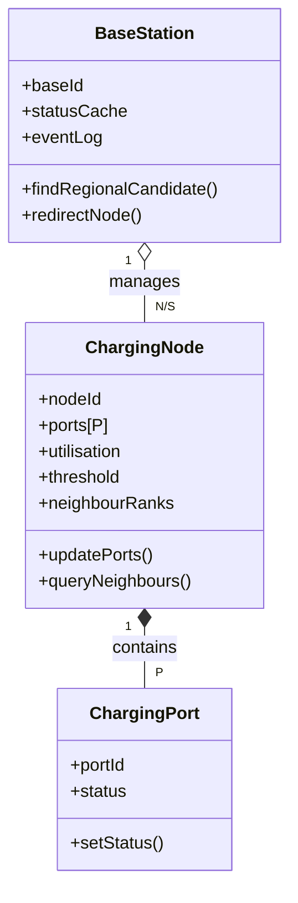
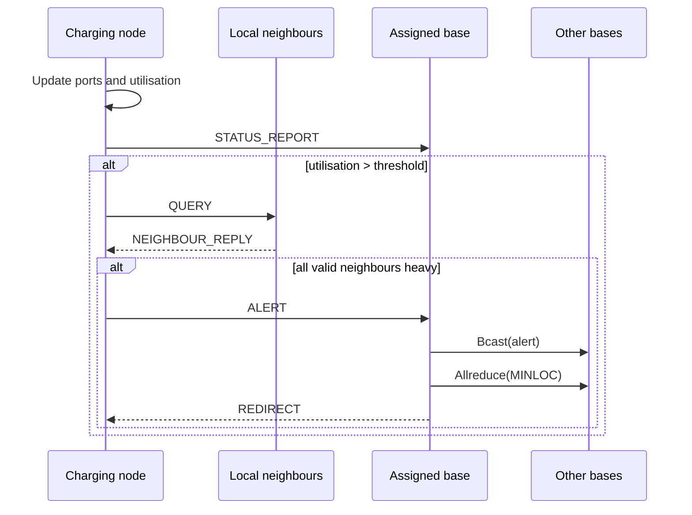
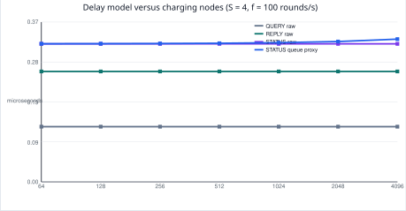
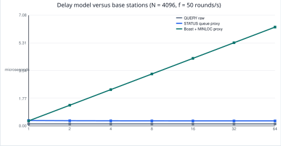
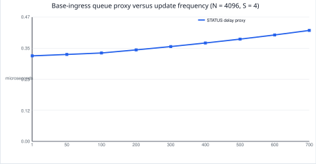

# FIT3143 Applied #1 - Distributed EV Charging Navigation System

**Team:** Group 07
**Students:** `[replace with names, student IDs, and Monash emails]`
**Unit:** FIT3143 Parallel Computing

## Executive summary

This report proposes an MPI-based simulator for a distributed Electric Vehicle Charging Navigation System (EVCNS). The design uses a hybrid topology because local congestion sensing, regional reporting, and global redirection have different communication scopes. Charging nodes use a non-periodic 2-D **logical** mesh for local neighbour sensing; regional base stations form a star forest for node reporting; bases use a small control-plane overlay for global nearest-station selection. The mesh is a repeatable simulation baseline, not a claim that physical EV stations are arranged in a perfect grid.

---

# Task 1 - Network topology

## Problem interpretation and modelling boundary

The specification's 3 x 3 layout is illustrative. Real charging stations may be placed irregularly, and this assessment does not ask students to construct their physical locations or radio links. The required property is that a charging node communicates with its immediate adjacent nodes and with a base station.

We therefore distinguish:

1. **Physical deployment:** real stations, roads, radio coverage, and infrastructure. These are external constraints.
2. **Logical topology:** the communication relationships represented by the simulator.
3. **Execution mapping:** placement of MPI processes on machines and cores. Execution placement must not redefine logical neighbours.

An immediate neighbour is a logical local communication relationship. It is not necessarily the physically closest station and does not require a dedicated physical cable.

## Topology comparison

| Topology | Degree | Diameter | Link cost | EVCNS assessment |
|---|---:|---:|---:|---|
| Linear array | 1-2 | `N-1` | `N-1` | Remote local queries can take `O(N)` hops; poor 2-D locality. |
| Ring | 2 | `floor(N/2)` | `N` | Bounded degree but only two neighbours; wrap-around is often artificial. |
| Star | 1 / `N-1` | 2 | `N` | Suitable for reporting to a base, not local neighbour sensing; central bottleneck. |
| Binary tree | 1-3 | `O(log N)` | `N-1` | Useful broadcast structure, but parent-child links are not geographic locality. |
| **2-D mesh** | **2-4** | **`O(sqrt(N))`** | **`O(N)`** | **Selected regular-area local overlay: bounded degree, locality, no central hub.** |
| 2-D torus | 4 | `O(sqrt(N))` | `O(N)` | Creates false wrap-around neighbours across service-area boundaries. |
| 3-D mesh / cube | 3-6 | `O(N^(1/3))` | `O(N)` | Introduces a third locality dimension without a natural urban interpretation. |
| Hypercube | `log2(N)` | `log2(N)` | `N log2(N)/2` | Growing degree and non-geographic links do not improve local station sensing. |
| Fully connected | `N-1` | 1 | `N(N-1)/2` | Minimum hops but not scalable for large charging-node populations. |

## Selected hybrid topology

### Local sensing plane - non-periodic 2-D logical mesh

For the simulator's regular-area baseline, nodes form a non-periodic mesh. Interior nodes have four neighbours, edge nodes have three, and corner nodes have two. The maximum degree is four and there are no torus wrap-around edges.

For `N = RC` nodes, the number of undirected local links is:

```text
E = R(C - 1) + C(R - 1) = 2N - R - C
```

Thus local link cost is `O(N)`. The model supports local congestion confirmation without the `O(N^2)` link cost of a fully connected node layer.

### Regional reporting plane - star forest

Each charging node reports directly to one assigned regional base. With `S` bases, this creates a forest of regional stars. Each base manages approximately `N/S` nodes and receives status reports and alerts only from its assigned region.

### Inter-base control plane - small coordination overlay

Bases are logically mutually reachable through a shared-backbone control plane. This does not claim dedicated physical full-mesh links. It means that a small group of base processes can coordinate for the relatively infrequent global nearest-station decision.

### Conclusion

The system does not use one topology for all traffic. The mesh preserves local sensing, regional stars aggregate control messages, and the base overlay supports global coordination. For strongly irregular deployments, a configured adjacency graph is future work; it is not claimed as the main baseline used in this report.

---

# Task 2 - MPI simulation architecture

## Model components

| Component | State | Responsibility |
|---|---|---|
| `ChargingPort` | `portId`, busy/free status | Represents a single charging port. |
| `ChargingNode` | id, logical position, `ports[P]`, utilisation, threshold, neighbour ranks | Updates local state, checks neighbours, reports to the base. |
| `BaseStation` | id, owned region, status cache, event log | Receives data, logs state, finds regional candidates, redirects nodes. |
| `Topology` | mesh dimensions, base ownership | Defines local mesh neighbours and region assignment. |



## MPI roles and communicators

- Ranks `0 ... S-1`: base-station processes.
- Ranks `S ... S+N-1`: charging-node processes.
- Total MPI ranks: `N + S`.
- `MPI_COMM_WORLD`: direct node-base control messages and lifecycle synchronisation.
- `node_comm`: charging-node ranks only.
- `cart_comm`: a non-periodic Cartesian communicator derived from `node_comm`; used for local mesh neighbours.
- `base_comm`: base-station ranks only; used for base coordination.

With `C` usable cores per machine, a one-rank-per-core baseline requires:

```text
machines = ceil((N + S) / C)
```

Adjacent mesh tiles should be mapped to the same or nearby hosts when possible, reducing cross-host local traffic without changing the logical topology.

## Protocol for one simulation round

1. Each charging node updates local `ports[P]` and calculates utilisation.
2. Every node sends `STATUS_REPORT` to its assigned base, which refreshes its cache and writes a log entry.
3. A node whose utilisation exceeds the user-configured threshold sends `QUERY` to each valid local neighbour.
4. Queried neighbours return `NEIGHBOUR_REPLY` with availability and utilisation.
5. If the node and all valid neighbours are above threshold, it sends `ALERT` to its base.
6. The alert owner broadcasts the alert to other bases. Every base searches its own cache for the regional nearest available candidate.
7. `Allreduce(MINLOC)` chooses the globally nearest available candidate.
8. The owner base returns `REDIRECT` to the alerting node.



If neighbour data is missing or stale, the node records an incomplete local assessment and does not generate an all-neighbours saturation alert. This prevents a false positive.

## Hybrid parallelism

MPI provides inter-process communication. OpenMP can parallelise a sufficiently large local `ports[P]` scan inside a charging-node process; for small `P`, serial scanning is preferred because thread overhead may dominate. MPI calls are made by the master thread under an `MPI_THREAD_FUNNELED` design.

```text
MPI ranks per host x OpenMP threads per rank <= physical cores per host
```

---

# Task 3 - Communication analysis

## Assumptions and message sizes

The cluster uses 1 Gbps links. The following payload sizes are explicit analytical assumptions, not measured packet sizes:

| Message | Payload assumption |
|---|---:|
| `QUERY` | 16 B |
| `NEIGHBOUR_REPLY` | 32 B |
| `STATUS_REPORT` | 40 B |
| `ALERT` | 24 B |
| `REDIRECT` | 32 B |
| `Bcast(alert)` | 24 B |
| `Allreduce(MINLOC)` candidate | 16 B |

The serialisation component of transmission delay is:

```text
T_tx = 8 L H_fabric / B
```

`H_fabric` is treated as a constant with respect to `N`; in the plotted equivalent-link model, `H_fabric = 1`. It is not the logical mesh diameter. Real wall-clock delay also includes MPI startup, switching, contention, and queueing.

## Scaling with the number of charging nodes

For the mesh, `E = 2N - R - C`. In the worst case, every node is above threshold:

```text
QUERY messages           = 2E
NEIGHBOUR_REPLY messages = 2E
Total local traffic      = 4E = O(N)
```

Each local transfer has an `O(1)` serialisation term, but aggregate local traffic grows as `O(N)`.

Every node sends one `STATUS_REPORT` per round, so bases receive `N` reports in total and approximately `N/S` reports each under a balanced partition. A direct report, alert, or redirect has `O(1)` raw serialisation with respect to `N`; base ingress queueing and round completion grow approximately as `O(N/S)`.

Let `A` be alerts in a round. `ALERT` and `REDIRECT` traffic is `O(A)`, with `0 <= A <= N`. Every alert invokes base coordination. Under a tree-based collective model:

```text
T_coordination_per_round = O(A log S)
```

If all nodes alert, `A = N`, giving the critical-path upper bound `O(N log S)`. This is not a claim that collective total network work is always `O(N log S)`; that depends on the implementation.

## Effect of increasing base stations

| Message type | Effect of increasing `S` |
|---|---|
| `QUERY`, `NEIGHBOUR_REPLY` | Unchanged because the local mesh is unchanged. |
| `STATUS_REPORT`, `ALERT`, `REDIRECT` | Per-base ingress falls from approximately `O(N)` toward `O(N/S)`. |
| `Bcast`, `Allreduce` | Critical path grows approximately as `O(log S)` per alert. |

More bases reduce regional queueing, not the raw serialisation time of a direct control message. The design therefore exhibits diminishing returns: reduced `N/S` load competes with increased collective coordination.

When `S = 1`, the single base's regional cache is also the global cache. Base coordination degenerates to a singleton operation and no cross-base communication is required.

## Analytical figures

The figures below use stated modelling assumptions. They distinguish constant raw serialisation delay from an illustrative base-ingress queueing proxy.







---

# Limitations and future work

- The local mesh is a logical regular-area baseline. An irregular production deployment would use a configured bounded-degree adjacency graph.
- The analysis models payload serialisation and a simple queueing proxy. It does not replace target-cluster measurements using `MPI_Wtime`.
- A production system would require stale-data expiry, failure detection, security, authentication, and durable state storage.
- OpenMP should be enabled only when port-level work is large enough to offset thread overhead.

# References

1. FIT3143 Applied #1 - Distributed Wireless Sensor Network assessment specification.
2. FIT3143 Applied #1 marking rubric.
3. FIT3143 Topic 5 - network topology and MPI material.
4. Teaching-team Ed clarification: the 3 x 3 grid is illustrative; immediate adjacent-node communication is required; topology or hybrid topology should be selected for a real-life situation.
