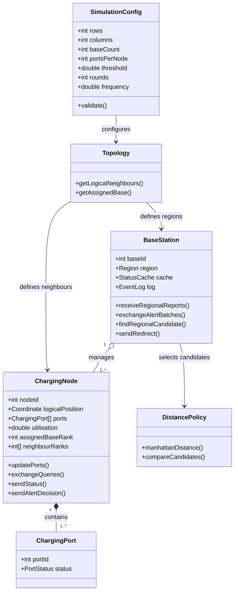
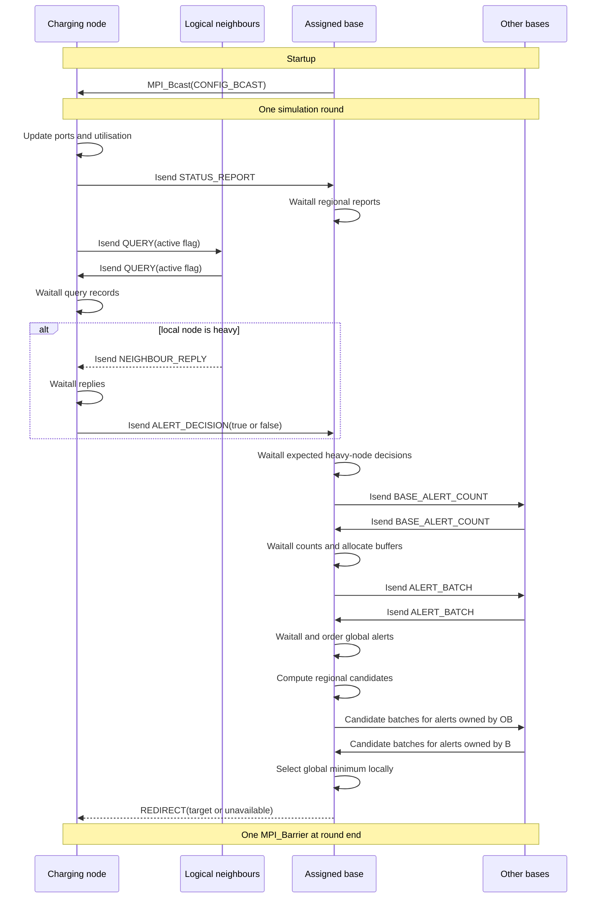

# Task 2 — Final Teaching-Aligned MPI Architecture

> **Scope.** This is the final Task 2 design. It preserves the three-plane architecture selected in Task 1 while using only MPI calls explicitly introduced in Applied Week 5. It is a proposed simulation architecture; no implementation is claimed.

## 1. Design decision

The simulator contains three logical communication relationships:

| Plane | Relationship | Implementation in Task 2 |
|---|---|---|
| Local sensing | charging node ↔ logical neighbours | Non-blocking point-to-point communication. |
| Regional reporting | charging nodes ↔ assigned base | A regional star implemented with direct point-to-point communication. |
| Global control | base station ↔ base station | A small logically complete overlay implemented with batched non-blocking point-to-point exchanges. |

The logical topology is independent of the MPI helper APIs. A 2-D logical mesh does not require `MPI_Cart_create`, and a complete base overlay does not require a collective operation. Consequently, the architecture can be retained without using MPI APIs outside the Applied Week 5 material.

## 2. Baseline assumptions

| Parameter | Baseline | Meaning |
|---|---:|---|
| `R × C` | `8 × 8` | Non-periodic logical mesh. |
| `N = RC` | 64 | Charging-node ranks. |
| `S` | 4 | Base-station ranks. |
| `P` | 16 | Ports stored locally by each charging node. |
| `threshold` | user configured | Heavy-utilisation threshold. |
| `f` | 1 round/s | Update frequency used for bandwidth sizing. |
| `C_host` | 32 | Physical cores per machine. |
| `B` | 1 Gbps | External network link rate. |

The baseline is pure MPI: one rank uses one physical core. OpenMP is not required by this teaching-aligned design. It may be investigated later, but would require a separately justified MPI thread-support policy.

## 3. Components

| Component | Important state | Responsibility |
|---|---|---|
| `SimulationConfig` | rows, columns, base count, ports per node, threshold, rounds, frequency | Validate and distribute immutable configuration. |
| `ChargingPort` | port id and free/busy state | Represent one local charging port. It is not an MPI rank. |
| `ChargingNode` | node id, logical coordinate, ports, utilisation, assigned base, neighbour ranks | Update ports, query logical neighbours, report status and produce an alert decision. |
| `BaseStation` | base id, owned region, status cache, event log | Receive regional data, exchange alert batches, compute candidates and issue redirects. |
| `Topology` | mesh dimensions and regional ownership | Compute valid logical neighbours and the assigned base using rank arithmetic. |
| `DistancePolicy` | Manhattan distance and tie-break rule | Select the nearest eligible node deterministically. |



## 4. Rank mapping and logical neighbours

World ranks are allocated as follows:

```text
base ranks:          0 ... S-1
charging-node ranks: S ... S+N-1
total ranks:         N+S
```

Only `MPI_COMM_WORLD` is required. Message tags distinguish protocol phases and business messages.

For a charging-node world rank `rank`:

```text
nodeIndex = rank - S
row       = nodeIndex / C
column    = nodeIndex % C
```

The non-periodic logical neighbours are calculated by boundary checks:

```text
northIndex = row > 0       ? nodeIndex - C : invalid
southIndex = row < R-1     ? nodeIndex + C : invalid
westIndex  = column > 0    ? nodeIndex - 1 : invalid
eastIndex  = column < C-1  ? nodeIndex + 1 : invalid

neighbourWorldRank = S + neighbourIndex
```

This produces exactly the same corner, edge and interior relationships as a non-periodic Cartesian mesh without requiring `MPI_Dims_create`, `MPI_Cart_create` or `MPI_Cart_shift`.

For the `8 × 8`, four-region baseline, each base owns one `4 × 4` tile. Region ownership is calculated from the logical row and column, not from the physical host name.

## 5. Business messages and MPI mapping

Payload sizes below are explicit analytical assumptions and exclude MPI/network headers.

| Message/data type | Sender → receiver | Trigger/frequency | Payload | MPI primitive | Count/scaling |
|---|---|---|---:|---|---|
| `CONFIG_BCAST` | coordinator base 0 → all ranks | Once at startup | 64 B | `MPI_Bcast` | One collective. |
| `STATUS_REPORT` | node → assigned base | Once per round | 32 B | `MPI_Isend`, `MPI_Irecv`, `MPI_Waitall` | `N` per round; about `N/S` per base. |
| `QUERY` | node → each valid neighbour | One record per neighbour per round; `active=true` only when the sender is heavy | 16 B | `MPI_Isend`, `MPI_Irecv`, `MPI_Waitall` | `2E_mesh` records per round; at most `2E_mesh` active queries. |
| `NEIGHBOUR_REPLY` | neighbour → active querying node | For each active `QUERY` | 24 B | `MPI_Isend`, `MPI_Irecv`, `MPI_Waitall` | At most `2E_mesh` per round. |
| `ALERT_DECISION` | heavy node → assigned base | Exactly once for every locally heavy node after replies | 32 B | `MPI_Isend`, `MPI_Irecv`, `MPI_Waitall` | `H` per round, where `0 ≤ A ≤ H ≤ N`; `active=true` for the `A` real alerts. |
| `BASE_ALERT_COUNT` | each base → every other base | Once per round | 4 B | `MPI_Isend`, `MPI_Irecv`, `MPI_Waitall` | `S(S-1)` count records. |
| `ALERT_BATCH` | each base → every other base | After counts are known | 32 B per active alert | `MPI_Isend`, `MPI_Irecv`, `MPI_Waitall` | `A(S-1)` alert records. |
| `CANDIDATE_BATCH` | each base → the owner base of each alert | After regional search | 16 B per candidate | `MPI_Isend`, `MPI_Irecv`, `MPI_Waitall` | `A(S-1)` external candidate records; the owner already has its local candidate. |
| `REDIRECT` | alert-owning base → source node | After global winner selection | 24 B | `MPI_Send`, `MPI_Recv` | At most `A` per round. |
| `ROUND_SYNC` | all ranks | Once at the end of each round, including the final round | 0 B | `MPI_Barrier` | One synchronisation collective per round. |

`MPI_Waitall`, tags and completion checks are protocol mechanisms, not additional business-message types.

### Why `QUERY` contains an active flag

Conditional receives are difficult to complete safely when a process does not know whether a neighbour will send. Each node therefore exchanges one small fixed `QUERY` record with every valid neighbour:

```text
active = localUtilisation > threshold
```

Only an active record is a business-level query and produces `NEIGHBOUR_REPLY`. The fixed exchange lets every node post a known number of receives and prevents indefinite waiting. In the worst case, all query records are active, so the existing worst-case traffic bound is unchanged.

### Why `ALERT_DECISION` is sent by every heavy node

After receiving all `STATUS_REPORT` records, a base knows exactly which of its regional nodes are locally heavy. If there are `H_s` such nodes, it posts exactly `H_s` receives for `ALERT_DECISION`.

Each heavy node returns one decision:

```text
active = all valid neighbour replies are current
         and above threshold
```

An active decision is the specification's `ALERT`. An inactive decision explicitly completes the node's alert phase without creating a false alert. This removes the unsafe assumption that an unsuccessful `MPI_Iprobe` means no more alerts will arrive.

## 6. One simulation round

### Phase 0 — initialisation

1. Every process calls `MPI_Init`, `MPI_Comm_rank` and `MPI_Comm_size`.
2. Rank 0 validates configuration.
3. All ranks call `MPI_Bcast` in the same order to receive `CONFIG_BCAST`.
4. Each node computes its logical coordinate, neighbours and assigned base.

### Phase 1 — local update and regional status

1. Each charging node updates its local `ports[P]` and calculates utilisation.
2. Every base posts one `MPI_Irecv` for each assigned node.
3. Every node sends one `STATUS_REPORT` with `MPI_Isend`.
4. Nodes complete their send, and bases use `MPI_Waitall` to obtain a complete regional snapshot.
5. From the status records, each base knows the number and identities of heavy regional nodes.

### Phase 2 — safe logical-neighbour exchange

1. Every node posts one `MPI_Irecv` for a `QUERY` record from each valid neighbour.
2. Every node sends one `QUERY` record, with its `active` flag, to each valid neighbour using `MPI_Isend`.
3. `MPI_Waitall` completes the fixed query-intent exchange.
4. A heavy node posts one reply receive for each valid neighbour.
5. A node sends `NEIGHBOUR_REPLY` to every neighbour whose received query record was active.
6. The heavy requesting node uses `MPI_Waitall` and validates `roundId` before evaluating the replies.

The baseline assumes reliable MPI ranks: every valid active query receives a reply. A mismatched `roundId` is stale and produces an inactive alert decision. Process-failure timeout handling is future work.

### Phase 3 — regional alert completion

1. Each base posts one receive for every heavy node identified in Phase 1.
2. Each heavy node sends exactly one `ALERT_DECISION`.
3. The base uses `MPI_Waitall`, retains only active decisions and sorts them by `(roundId, sourceNodeId)`.
4. The number of retained records is the base's `localAlertCount`.

### Phase 4 — teaching-aligned base-to-base batch exchange

The `S` bases are the only participants, but they use their known world ranks and `MPI_COMM_WORLD` point-to-point operations.

1. Each base posts `S-1` count receives.
2. Each base sends `localAlertCount` to the other `S-1` bases.
3. `MPI_Waitall` completes count exchange.
4. Counts determine the exact receive-buffer sizes for each remote batch.
5. Bases post variable-count `MPI_Irecv` operations and send their local alert arrays with `MPI_Isend`.
6. `MPI_Waitall` completes the batch exchange.
7. Every base constructs the same globally ordered alert list.

This provides the required variable-size exchange without `MPI_Allgatherv`.

### Phase 5 — globally correct candidate selection

For each alert, every base searches only its regional cache. A candidate is eligible when it has at least one free port and its utilisation is at or below the threshold.

Logical distance is:

```text
d = abs(sourceRow - candidateRow)
  + abs(sourceColumn - candidateColumn)
```

Candidate ordering is deterministic:

```text
1. available candidates beat unavailable candidates;
2. smaller logical distance wins;
3. equal distance is resolved by smaller nodeId.
```

Each base groups its candidate records by the base that owns each alert source. For alerts owned by base `b`, every other base sends one candidate vector to `b`. The owner posts the matching receives, waits for all `S-1` vectors and combines them with its local candidates using the comparison above.

This produces the same global decision as a minimum-location reduction without using `MPI_MINLOC`.

### Phase 6 — redirect and round completion

1. The alert-owning base sends `REDIRECT` to each alert source.
2. An alerting node waits with `MPI_Recv` because it needs the decision to complete its workflow.
3. Non-alerting nodes may reach the round-end synchronisation earlier.
4. All ranks call one `MPI_Barrier` only after the complete round, preventing messages from adjacent rounds from being mixed.

Collectives are never inserted after every message. Every rank calls the startup broadcast and the round-end barriers in the same order.

## 7. Communication sequence



## 8. Deadlock and correctness rules

1. Post non-blocking receives before the matching sends whenever the message set is known.
2. Complete every `MPI_Isend` and `MPI_Irecv` with `MPI_Wait`, `MPI_Waitall` or an equivalent taught completion operation.
3. Do not reuse a non-blocking send buffer before completion.
4. Use different tags for status, query, reply, alert decision, counts, batches, candidates and redirect.
5. Include `roundId` and relevant source identifiers in payloads so stale or mismatched records can be rejected.
6. Bases exchange counts before variable-size arrays, so every receive has a known size.
7. Every heavy node sends one alert decision, including a negative decision; therefore the base knows exactly when the regional alert phase is complete.
8. All bases sort alerts identically before candidate exchange.
9. All ranks call `MPI_Bcast` and `MPI_Barrier` in the same order.

## 9. Machine and core allocation

For the pure-MPI baseline, each charging node and each base uses one rank and one core:

```text
totalCores = N + S
machines_min = ceil((N + S) / C_host)
```

For `N=64`, `S=4` and `C_host=32`:

```text
totalCores = 64 + 4 = 68
machines_min = ceil(68/32) = 3
```

The selected deployment nevertheless uses four hosts, one per region:

| Host | Processes | Active cores | Purpose |
|---|---|---:|---|
| 0 | base 0 + 16 node ranks | 17 | top-left `4 × 4` region |
| 1 | base 1 + 16 node ranks | 17 | top-right `4 × 4` region |
| 2 | base 2 + 16 node ranks | 17 | bottom-left `4 × 4` region |
| 3 | base 3 + 16 node ranks | 17 | bottom-right `4 × 4` region |

Three machines are the packed mathematical minimum; four machines are the selected locality-aware mapping. The selected mapping keeps node-to-assigned-base traffic within a host and leaves 15 cores per host for runtime and future growth.

## 10. Required external bandwidth

For an `8 × 8` mesh:

```text
E_mesh = 8(8-1) + 8(8-1) = 112
```

Four `4 × 4` regional tiles create 16 cross-host mesh edges:

```text
E_cross = 8 vertical-boundary edges
        + 8 horizontal-boundary edges
        = 16
```

Let the worst case have all nodes heavy and all `A=N=64` heavy nodes generate active alerts.

### Cross-host neighbour traffic

Each cross-host undirected edge carries two query records and, in the worst case, two replies:

```text
D_neighbour
= 2 E_cross (L_query + L_reply)
= 2(16)(16 + 24)
= 1,280 B/round
```

### Base alert-count exchange

```text
D_count
= S(S-1)L_count
= 4(3)(4)
= 48 B/round
```

### Base alert-batch exchange

Every active alert is delivered to the other `S-1` bases:

```text
D_alertBatch
= A(S-1)L_alert
= 64(3)(32)
= 6,144 B/round
```

### Candidate-to-owner exchange

For every alert, the owner base already has its own candidate and receives one candidate from each of the other `S-1` bases:

```text
D_candidate
= A(S-1)L_candidate
= 64(3)(16)
= 3,072 B/round
```

`STATUS_REPORT`, `ALERT_DECISION` and `REDIRECT` remain intra-host under the selected deployment, so they do not consume external bandwidth in this baseline.

The total estimated aggregate external payload is:

```text
D_external
= 1,280 + 48 + 6,144 + 3,072
= 10,544 B/round
```

Using a stated 25% protocol and safety margin:

```text
BW_required
= 1.25 × 8 × f × D_external
```

At `f=1 round/s`:

```text
BW_required
= 1.25 × 8 × 1 × 10,544
= 105,440 bit/s
= 0.10544 Mbps
```

At `f=10 rounds/s`:

```text
BW_required = 1.0544 Mbps
```

This is an aggregate offered-load estimate, not a measurement of one physical link. Nevertheless, because the entire baseline aggregate is far below 1 Gbps, the specified link rate is sufficient under the stated assumptions. A real implementation should measure MPI headers, startup latency, switch contention and per-host NIC load.

## 11. Applied Week 5 API compliance

The core design uses only:

```text
MPI_Init
MPI_Comm_rank
MPI_Comm_size
MPI_Bcast
MPI_Send
MPI_Recv
MPI_Isend
MPI_Irecv
MPI_Wait
MPI_Waitall
MPI_Barrier
MPI_Wtime
MPI_Finalize
```

If structured payloads are implemented as MPI datatypes, Applied Week 5 also supports:

```text
MPI_Get_address
MPI_Type_create_struct
MPI_Type_commit
MPI_Type_free
```

The final baseline deliberately does not depend on:

```text
MPI_Comm_split
MPI_Dims_create
MPI_Cart_create
MPI_Cart_shift
MPI_Allgatherv
MPI_MINLOC
MPI_Init_thread
```

## 12. Task 2 conclusion

The design preserves the selected non-periodic logical mesh, regional-star reporting structure and small complete base-control overlay using only MPI facilities introduced in Applied Week 5. Rank arithmetic defines the logical mesh; direct non-blocking operations implement regional and base-to-base exchanges; fixed query records and alert decisions make every communication phase finite; and owner-side comparison produces the globally nearest candidate without `MPI_MINLOC`. The four-host baseline needs only approximately `0.10544 Mbps` of aggregate external bandwidth at one round per second under the stated worst-case workload.
