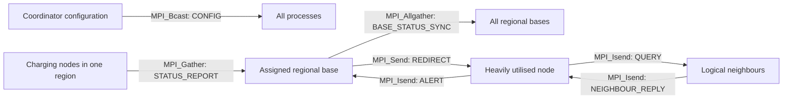

# Task 2 — Simplified Message Types and MPI Mapping

## 1. Recommended scope

Task 2 does not need a long list of low-level protocol messages. The design can be explained with:

- **five main application message types**: `STATUS_REPORT`, `QUERY`, `NEIGHBOUR_REPLY`, `ALERT`, and `REDIRECT`;
- **two supporting collective data types**: `CONFIG` and `BASE_STATUS_SYNC`.

Therefore, Task 3 should analyse **seven communication/data types in total**. Calls such as `MPI_Waitall` and `MPI_Iprobe` are completion or detection operations, not additional message types.

This document is only the message/MPI decision chart. It is not the complete Task 2 response.

## 2. Communication overview

## 3. Message-to-MPI mapping

| No. | Data or message type | Direction | MPI category | Recommended MPI calls | Reason for the choice |
|---:|---|---|---|---|---|
| 1 | `CONFIG` | Coordinator → all processes | Blocking collective | `MPI_Bcast` | Every process needs the same threshold, round count, topology dimensions, and simulation parameters. Broadcasting is clearer than sending the same configuration separately to every rank. |
| 2 | `STATUS_REPORT` | Each charging node → its assigned regional base | Blocking collective | `MPI_Gather` on that region's communicator | Every node contributes one fixed-size status record during each scheduled reporting phase. The regional base is the gather root. The collective replaces many manually managed point-to-point receives. |
| 3 | `BASE_STATUS_SYNC` | Every regional base ↔ all regional bases | Blocking collective | `MPI_Allgather` on the base-station communicator | Each base contributes its fixed-size regional status block and receives the blocks from all other bases. Every base then has the same global availability view and can calculate a redirect without contacting every charging node. |
| 4 | `QUERY` | Heavily utilised node → its valid logical neighbours | Non-blocking point-to-point | `MPI_Isend` with matching `MPI_Irecv`/`MPI_Iprobe` | A node may contact several neighbours at once. Non-blocking calls avoid serial query delays and allow useful work while messages are in flight. |
| 5 | `NEIGHBOUR_REPLY` | Queried neighbour → requesting node | Non-blocking point-to-point | `MPI_Isend`, `MPI_Irecv`, then `MPI_Waitall` | Replies from different neighbours may arrive in any order. Posting receives first and waiting for the set at the end avoids order-dependent deadlock. Buffers must not be reused before completion. |
| 6 | `ALERT` | Alerting node → its assigned regional base | Non-blocking point-to-point | `MPI_Isend`; base detects with `MPI_Iprobe` and receives with `MPI_Recv` | Alerts are conditional and event-driven, so the base should not block waiting for an alert that may never be sent. The sending node completes the request with `MPI_Wait` or `MPI_Test`. |
| 7 | `REDIRECT` | Assigned regional base → alerting node | Blocking point-to-point | `MPI_Send` and `MPI_Recv` | After sending an alert, the node genuinely needs the selected alternative before completing the event. A blocking receive is therefore simple and semantically appropriate. |

## 4. Blocking, non-blocking, and collective roles

| MPI style | Used for | Why it fits |
|---|---|---|
| Blocking point-to-point | `REDIRECT` | The receiver cannot continue the alert workflow until the decision arrives. |
| Non-blocking point-to-point | `QUERY`, `NEIGHBOUR_REPLY`, `ALERT` | These communications can involve several peers or may occur conditionally. Non-blocking operations reduce unnecessary waiting and avoid dependence on arrival order. |
| Collective | `CONFIG`, `STATUS_REPORT`, `BASE_STATUS_SYNC` | All members of the relevant communicator participate in the same scheduled phase, so broadcast and gather-family operations express the communication directly. |

The program should use separate communicators so that a collective includes exactly the relevant processes:

- one **regional communicator** per base station and its assigned charging nodes for `MPI_Gather`;
- one **base-station communicator** containing only base processes for `MPI_Allgather`;
- the charging-node communicator and logical-neighbour information for local point-to-point exchanges.

For the baseline, every base sends a fixed-size regional block in `MPI_Allgather`. If regions contain different numbers of nodes, the block is sized for the largest region and unused entries are marked invalid. This preserves the simple `MPI_Allgather` design covered in the Week 5 material.

## 5. Deliberately excluded MPI operations

- `MPI_Scatter` is unnecessary because configuration data is identical for all ranks; `MPI_Bcast` is the correct operation.
- `MPI_Barrier` should not be inserted after every communication. There is no separate algorithmic dependency requiring a full barrier after these collective phases.
- `MPI_Reduce`/`MPI_Allreduce` is not required in this simplified version because `MPI_Allgather` gives each base the data needed to select the closest available node locally.
- `MPI_Ssend`, `MPI_Bsend`, and `MPI_Rsend` add complexity without solving a requirement that the selected operations do not already address.

## 6. Concise decision

Use **five application messages plus two collective control records**. This is enough to represent the required behaviour while demonstrating the Week 5 MPI concepts intentionally: blocking point-to-point communication, non-blocking point-to-point communication with completion checks, and collective communication using broadcast and gather-family operations.

> Source basis: Week 5 Applied Preparation slides on blocking and non-blocking point-to-point communication, completion routines, and collective operations (`MPI_Bcast`, `MPI_Gather`, and `MPI_Allgather`).
